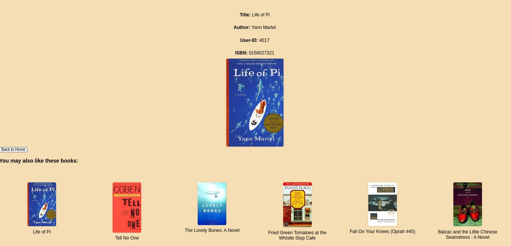

# Book Recommendation System

This project implements a straightforward book recommendation system based on collaborative filtering. By utilizing cosine similarity between book vectors, it suggests books to users.
# 

## Deployment Status
We are currently in the process of deploying the system to Vercel. Please bear with us as we finalize the setup.

## Folder structure:
- you can run the project by:
  
 - `` cd project initiation``
 - `` python app.py ``
 - requirements.txt is not available nor the project deploment. so, soon it will be ready

## Project Members
- **Mandeep**: Frontend Engineer
- **Nikesh**: Backend Engineer
- **Myself**: ML Engineer

## Project Snaps:

## Kaggle Dataset
You can find the relevant dataset on Kaggle: Book Recommendation Dataset

Feel free to explore the data and contribute to the project! 📚🔍
